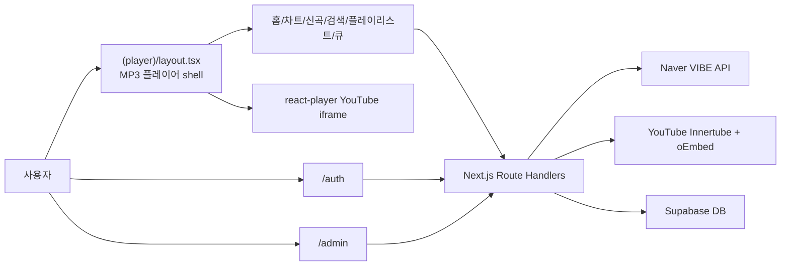

# 인공지능과 함께한 설계 문서

## 1. 프로젝트 주제

Musico는 YouTube iframe 재생과 Naver VIBE 음원 목록을 결합한 무료 음악 스트리밍 웹 서비스이다. 사용자는 차트, 신곡, 검색, 관리자 편성 플레이리스트에서 곡을 선택하고, 웹에 구현된 MP3 플레이어 형태의 UI로 재생을 조작한다.

처음에는 단순한 차트와 플레이어 형태였지만, 인공지능과 논의하며 “웹 전체가 MP3 플레이어 본체가 되고, 내부 스크린만 라우팅되는 구조”로 방향을 변경했다. 이 구조는 페이지가 이동되어도 플레이어 layout이 유지되어 음악이 끊기지 않는다는 장점이 있다.

## 2. 핵심 설계 목표

- Next.js 16 App Router 기반으로 화면을 URL 단위로 분리한다.
- 플레이어는 `src/app/(player)/layout.tsx`에 두어 하위 페이지 전환 중에도 유지한다.
- 실제 음원 목록은 VIBE API에서 가져오고, 재생 가능한 영상은 YouTube Innertube 검색과 iframe 가능 여부 검증을 통해 결정한다.
- 로그인하지 않은 사용자는 차트, 신곡, 플레이리스트 화면에 접근하지 못하게 한다.
- 일반 사용자는 관리자 편성 플레이리스트를 조회하고 재생만 하며, 플레이리스트 편성은 관리자 페이지에서 처리한다.
- 한국어와 영어 메시지는 프로젝트 루트 `messages/app-messages.ts`에 모아 관리한다.

## 3. 기술 스택 선정

| 영역 | 선택 기술 | 이유 |
| --- | --- | --- |
| Framework | Next.js 16 App Router | 서버 컴포넌트, Route Handler, layout 유지 구조를 사용하기 적합 |
| Language | TypeScript | API 응답과 컴포넌트 props를 명확하게 관리 |
| Styling | Tailwind CSS v4 | 빠른 UI 구현과 토큰 기반 스타일 관리 |
| Database | Supabase | 사용자, 큐, 관리자 플레이리스트 저장 |
| Auth | 자체 JWT 로그인 + Supabase DB | 회원가입/로그인 요구사항과 보호 영역 구현 |
| Player | react-player | YouTube iframe 재생 제어 |
| Search | youtubei.js | YouTube 검색 결과에서 lyrics 영상 후보 탐색 |
| Image | next/image | 앨범아트 최적화 |

## 4. 아키텍처

## 5. 주요 화면 설계

- 홈: 추천 섹션, 빠른 선택, 차트 미리보기
- 차트: VIBE Top 100 기반 음원 목록
- 신곡: VIBE 최신곡 목록
- 검색: 사용자가 입력한 키워드 기반 음원 검색
- 플레이리스트: 관리자가 편성한 공개 플레이리스트
- 재생목록: 현재 큐 확인, 특정 곡 재생, 큐에서 제거
- 관리자: 플레이리스트 생성/삭제, 곡 검색, 곡 추가/삭제
- 인증: 로그인 및 회원가입

## 6. 데이터 설계

### 사용자

- `musico_users`
- 회원 ID, 비밀번호 해시, refresh token, role, queue, original queue, current song 정보를 저장한다.
- role이 `admin`인 사용자는 관리자 Route Handler에 접근할 수 있다.

### 관리자 플레이리스트

- `musico_admin_playlists`
- 제목, 설명, 곡 목록, 생성/수정 시각을 저장한다.
- 일반 사용자는 조회와 재생만 가능하고, 생성/수정/삭제는 관리자만 가능하다.

### 곡 데이터

- VIBE에서 받은 곡 정보와 YouTube에서 검증한 `videoId`를 결합한다.
- 같은 곡을 다시 선택할 때도 최신 `videoId`로 큐 항목을 갱신하도록 설계했다.

## 7. 인증 및 보호 영역 설계

- `/api/auth/signup`: Supabase에 사용자 생성
- `/api/auth/login`: 비밀번호 검증 후 access token과 refresh token 발급
- `src/proxy.ts`: `/chart`, `/new`, `/playlists` 직접 접근 시 쿠키의 access token 검증
- 관리자 API: `getRequiredAdminUser`로 사용자 role 확인

## 8. 인공지능 활용 방식

인공지능은 단순 코드 생성을 넘어서 요구사항 분석, 구조 설계, UI 개선, 버그 원인 추적에 사용했다. 특히 다음 결정에 도움을 받았다.

- 기존 Express/FastAPI 백엔드 기능을 Next.js Route Handler로 옮기는 구조 설계
- MongoDB 방식의 사용자 큐/플레이리스트 데이터를 Supabase 테이블과 JSONB 구조로 재구성
- 플레이어 layout을 유지하여 페이지 전환 중 음악이 끊기지 않게 하는 App Router 설계
- 보호 라우트와 로그인 후 이동 흐름 설계
- iPod 형태의 MP3 플레이어 UI 방향 결정
- 다국어 메시지셋을 루트 `messages` 디렉토리에 통합하는 구조
