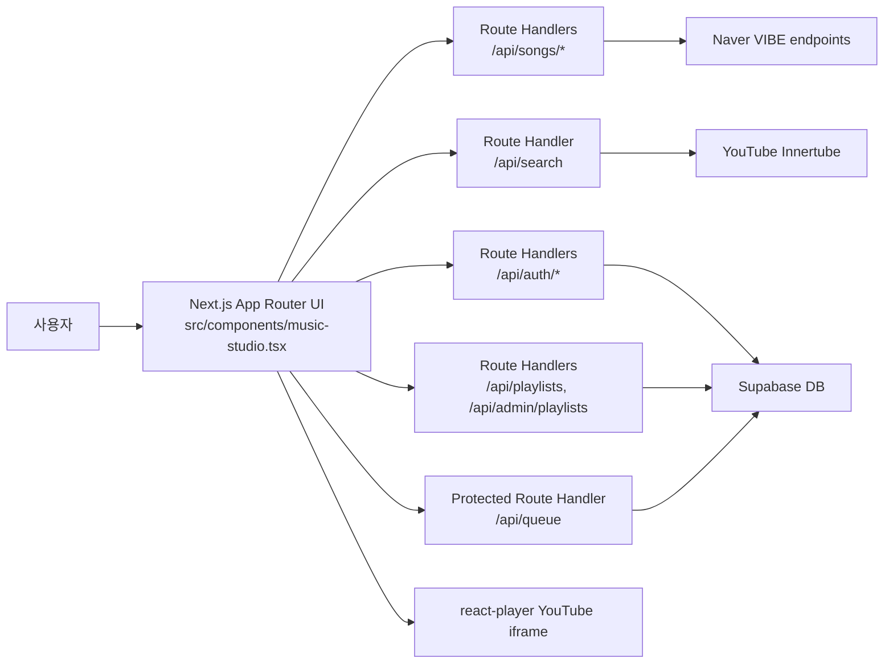

# Musico 기말 개별 프로젝트 보고서

## 1. 서비스 개요

Musico는 YouTube 검색 및 iframe 재생을 활용해 무료 음악 스트리밍 경험을 제공하는 웹 서비스이다. 사용자는 VIBE 기반 차트/신곡/검색 목록과 관리자가 편성한 플레이리스트에서 곡을 선택하고, 클래식 클릭휠 MP3 플레이어 형태의 UI에서 재생, 일시정지, 이전/다음곡, 셔플, 반복, 큐 기능을 사용할 수 있다.

## 2. 기술 스택

- Framework: Next.js 16.x App Router
- Language: TypeScript
- Styling: Tailwind CSS
- Auth/DB: Supabase, 자체 JWT 기반 로그인 API
- Server Logic: Next.js Route Handler
- Playback/Search: react-player, youtubei.js(innertube)
- Image Optimization: next/image

## 3. 아키텍처



## 4. 필수 요구사항 충족 현황

| 요구사항 | 충족 내용 |
| --- | --- |
| Next.js 16.x + App Router + TypeScript | `next@16.2.7`, `src/app/` 라우터, TypeScript 사용 |
| 한국어/영어 다국어 지원 | `src/components/music-studio.tsx`에서 `ko/en` 메시지 테이블과 언어 전환 버튼 제공 |
| DB/백엔드 연동 및 쓰기 | Supabase와 `/api/playlists`, `/api/admin/playlists`, `/api/admin/playlists/song`, `/api/queue`, `/api/auth/*` Route Handler 연동. 관리자 플레이리스트 생성/삭제 및 곡 추가/삭제 가능 |
| 로그인/인증 및 보호 영역 | 자체 회원가입/로그인 API, JWT 검증. `/api/queue` 등은 Authorization 토큰 없으면 접근 차단. 관리자 편성 API는 `musico_users.role = 'admin'` 계정만 접근 가능 |
| Route Handler 또는 Server Action | 모든 주요 서버 로직을 Route Handler로 구현 |
| 서비스 화면 3개 이상 | 홈, 차트, 신곡, 검색, 플레이리스트, 재생목록, 관리자 화면 제공 |
| 로딩/에러/없는 페이지 UI | `src/app/loading.tsx`, `src/app/error.tsx`, `src/app/not-found.tsx` 제공 |
| 이미지 최적화 | 앨범아트를 `next/image`로 렌더링하고 `next.config.ts`에 원격 이미지 도메인 등록 |
| 메타데이터/favicon/OG/sitemap | `src/app/layout.tsx`, `src/app/icon.svg`, `src/app/sitemap.ts`, `src/app/robots.ts` 제공 |
| 배포 | Vercel 배포 후 아래 URL 항목에 기입 |

## 5. 주요 화면

- 홈: 추천곡, 차트 미리보기, 현재 재생 상태
- 차트: VIBE Top 100 목록
- 신곡: VIBE 신곡 목록
- 검색: VIBE 검색 결과 및 YouTube 재생 후보 검증
- 플레이리스트: 관리자가 편성한 공개 플레이리스트 목록
- 재생목록: 현재 큐 목록 및 선택 재생
- 관리자: 플레이리스트 생성/삭제, 곡 검색, 재생 가능한 YouTube 영상 검증 후 곡 추가/삭제

## 6. 배포 URL

- 배포 URL: `TODO: Vercel 배포 후 URL 기입`

## 7. 테스트용 계정

Supabase 서비스 키와 DB 마이그레이션 적용 후 아래 계정으로 테스트한다.

- ID: `TODO`
- Password: `TODO`

## 8. 실행 방법

```bash
npm install
npm run dev
npm run build
```

필수 환경 변수:

```env
NEXT_PUBLIC_SUPABASE_URL=
NEXT_PUBLIC_SUPABASE_PUBLISHABLE_KEY=
NEXT_PUBLIC_SUPABASE_ANON_KEY=
SUPABASE_SERVICE_ROLE_KEY=
ACCESS_TOKEN_SECRET=
REFRESH_TOKEN_SECRET=
NEXT_PUBLIC_SITE_URL=
```

관리자 계정 지정 예시:

```sql
update public.musico_users
set role = 'admin'
where username = '관리자아이디';
```

## 9. AI 활용 및 구현 메모

AI 도구를 사용해 Next.js App Router 구조, Route Handler 마이그레이션, UI 리디자인, 평가 체크리스트 보강을 진행했다. 최종 코드는 직접 실행 가능한 형태로 구성했으며 `npm run lint`, `npm run build`로 검증했다.
